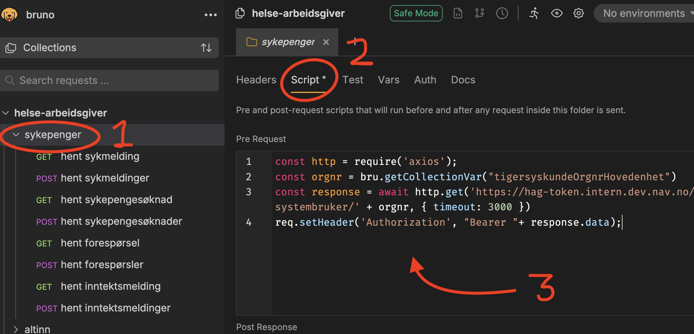

# Bruno template

### Setup


```
brew install bruno
```

Trykk denne knappen for å åpne prosjektet:
 
[](https://fetch.usebruno.com?url=https%3A%2F%2Fgithub.com%2Fnavikt%2Fbruno-template.git "target=_blank rel=noopener noreferrer")

______

### Pre-hook
Kjør denne kommandoen for å ikke tillate "eyJ" (starten på JWT) i alle Bruno relaterte filer:
```
git add hooks/pre-push
```

______

### Hente tokens
Under `Script` menyen kan man definere pre-request script for tokens.
